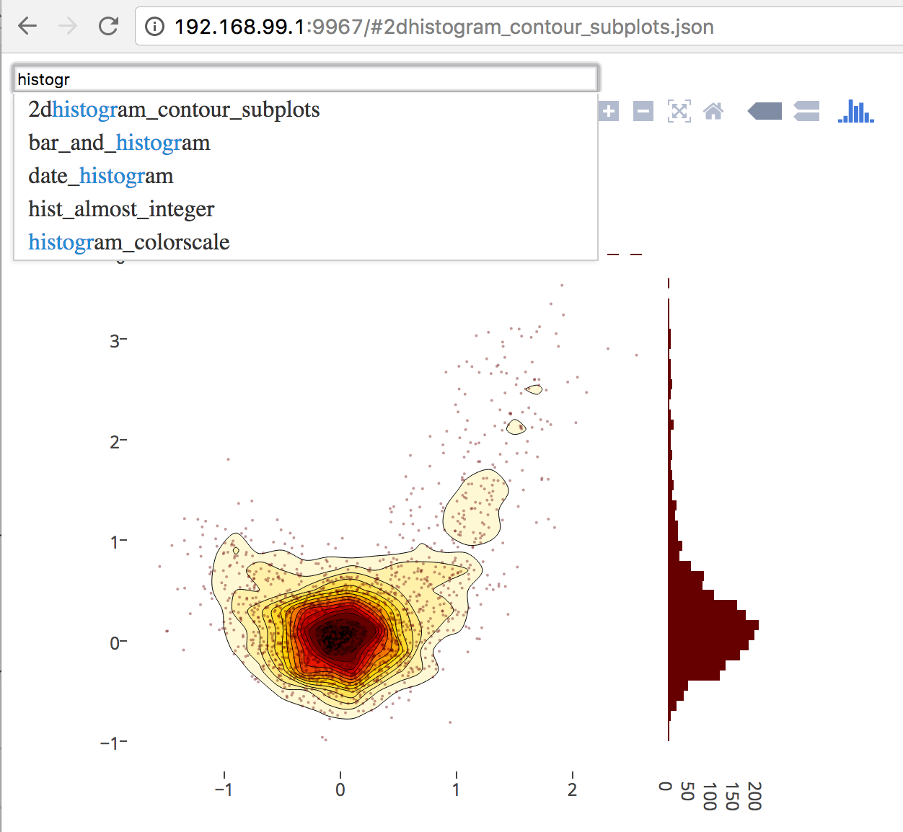

# plotly-standalone-mock-viewer



## Introduction

A budo-based live-reloading standalone viewer for plotly mocks. Advantages:

- refetches mock list on each reload (no need to restart server when mock files move around)
- live reload (devtools server was slow to compile and threw error more often than not as a result when reloading)
- Detailed JSON error messages that propagate to the browser console 🎉

To use:

```bash
$ git clone https://github.com/rreusser/plotly-standalone-mock-viewer.git
$ cd plotly-standalone-mock-viewer
$ <edit package.json to point to your local plotly.js repo>
$ npm install -g linklocal
$ linklocal
$ npm install
$ ./server.js
```

## License

Includes source of MIT-licensed [`JavaScript-autoComplete`](https://github.com/Pixabay/JavaScript-autoComplete)

&copy; 2017 Ricky Reusser. MIT License.
